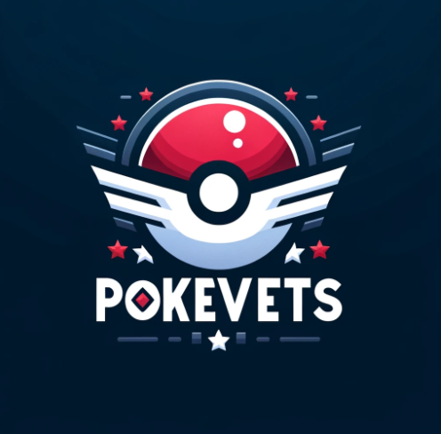

# PokeClone Deployment Project

This repository serves as the central hub for the deployment of the [PokeClone](https://github.com/phubui1996/pokeclone) application, an educational project developed by a separate team. PokeClone combines a React front-end with a Django back-end to offer a Pokemon-inspired gaming experience. The focus of our project is on implementing DevOps practices to automate, scale, and efficiently deploy this application on AWS cloud using a variety of technologies, including Terraform, Docker, Kubernetes, and AWS services.

## Objective

The primary objective is to apply knowledge and skills in various technologies and tools studied throughout the course, focusing on automation, scalability, and efficient deployment on the AWS cloud.

## Development Team

Stephan Lamoureux - [GitHub](https://www.github.com/stephanlamoureux)

Edwin Quito - [GitHub](https://github.com/epquito)

Xinxin Hou [GitHub](https://github.com/hxin1123)

## Repository Structure

The deployment of this app is split between two repositories. This one handles the Docker and Kubernetes, while the AWS infrastructure is created through our [Terraform](https://github.com/epquito/terraform-pokeclone) repo.

This repository is organized into multiple branches, each dedicated to different stages of the deployment process:

### `master` Branch

- Provides an overview of the project and links to other branches detailing specific deployment strategies.

### `local` Branch

- Contains instructions and configurations for setting up and running the PokeClone application in a local development environment.

### `docker` Branch

- Features Docker and Docker Compose configurations for containerizing the application. This branch focuses on building a Docker image for the application and running it locally using Docker Compose.

### `minikube` Branch

- This branch will contain instructions and configurations for deploying the PokeClone application on a local Kubernetes cluster using Minikube. It's aimed at developers looking to test Kubernetes deployment strategies locally.

### `EKS` Branch

- Dedicated to deploying the PokeClone application on AWS Elastic Kubernetes Service (EKS) for a production-ready environment with CI/CD through GitHub Actions.

### `EKS-RDS` Branch

- Instead of using a PostgreSQL container image for the database, this branch utilizes an AWS RDS database.

## Project Steps Overview

1. **Project Setup**: Initialize the local development environment and set up the project in a GitHub repository.
2. **Infrastructure Provisioning**: Use Terraform to provision AWS resources, including EC2, RDS, and EKS.
3. **Dockerization**: Create a multi-stage Dockerfile for the application and test the Docker image locally.
4. **Docker Compose**: Configure `docker-compose.yml` for local testing of the application and database services.
5. **Kubernetes Orchestration**: Deploy the application on Minikube, configure database connectivity using ConfigMap and Secrets, and define Kubernetes resources like deployments, services, and volumes.
6. **Continuous Integration**: Set up a CI workflow in GitHub Actions to build and test the Docker image.
7. **Continuous Delivery**: Automate the deployment process to EKS using GitHub Actions.
8. **Monitoring**: Utilize AWS CloudWatch for monitoring the EKS cluster and EC2 instances.
9. **Backup and Alerting**: Implement automated backups for RDS and EC2 volumes using Amazon EventBridge and configure SNS notifications for monitoring alerts.
10. **Autoscaling**: Configure autoscaling for the EKS cluster based on CPU utilization.
11. **DNS and Route53**: (Instructions only) Define steps for configuring DNS records using Route53.

By following the guidelines and instructions provided in each branch, the team aims to demonstrate a comprehensive approach to deploying a modern web application using best practices in DevOps and cloud computing.
