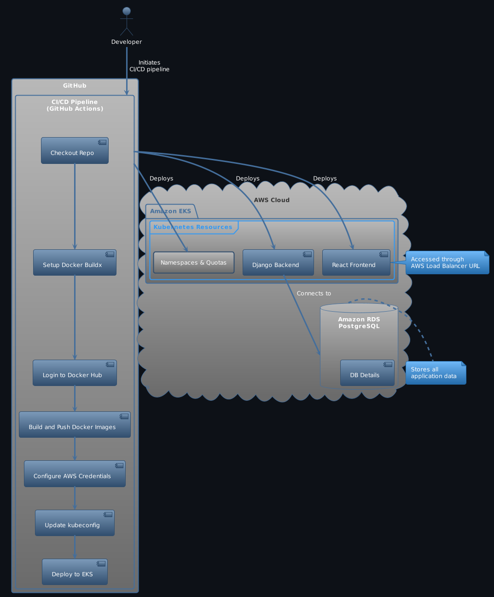

# Deploying with Amazon EKS & RDS

This guide provides instructions for deploying the application stack on Amazon Elastic Kubernetes Service (EKS), a managed Kubernetes service that makes it easier to run Kubernetes applications in the AWS cloud.

## Overview

The project utilizes Amazon EKS to deploy a full-stack application, comprising a React frontend and Django backend. The PostgreSQL database is hosted on Amazon RDS, providing a managed, scalable, and secure database environment. The deployment process is automated with GitHub Actions, enabling Continuous Integration (CI) and Continuous Deployment (CD) workflows.

## Diagram

This diagram emphasizes the CI/CD workflow that starts with a developer's action, proceeds through GitHub Actions, and ends with the deployment of the PokeClone application on Amazon EKS, using Amazon RDS for database services. It highlights how the Django backend and React frontend are deployed within the EKS environment, with the backend connecting to an Amazon RDS PostgreSQL instance for database services.

## Prerequisites

- An AWS account and AWS CLI installed and configured.
- Docker and kubectl installed locally.
- A GitHub account for setting up CI/CD with GitHub Actions.

## CI/CD Workflow Overview

The CI/CD pipeline is defined in `.github/workflows/pokeclone-cicd.yml` within the project repository and performs the following steps:

### Continuous Integration (CI)

1. **Checkout Repo**: Fetches the latest code from the specified branch.
2. **Setup Docker Buildx**: Prepares Docker for building images.
3. **Login to Docker Hub**: Authenticates to Docker Hub to enable image pushing.
4. **Build and Push Docker Images**: Builds Docker images for the frontend and backend and pushes them to Docker Hub.

### Continuous Deployment (CD)

1. **Checkout Repo**: Fetches the latest code for deployment.
2. **Configure AWS Credentials**: Sets up AWS credentials for EKS access.
3. **Update kubeconfig for EKS**: Configures `kubectl` to communicate with the Amazon EKS cluster.
4. **Deploy Resources to EKS**: Applies Kubernetes manifests to deploy namespaces, quotas, backend, and frontend to EKS. Configuration for the Amazon RDS PostgreSQL database is applied through environment variables and secrets.

### CI/CD Environment Variables

- `DOCKER_USERNAME` and `DOCKER_PASSWORD`: Used for Docker Hub authentication.
- `AWS_REGION`, `K8S_NAMESPACE`, `EKS_CLUSTER_NAME`, `DB_HOST`, `DB_USER`, `DB_PASSWORD`, and `DB_NAME`: Used to specify the AWS region, Kubernetes namespace, EKS cluster name, and Amazon RDS database connection details for the deployment.

## Setting up CI/CD

1. Fork or clone the repository to your GitHub account.
2. In your repository's Settings, navigate to Secrets and add the following secrets:
   - `DOCKER_USERNAME`: Your Docker Hub username.
   - `DOCKER_PASSWORD`: Your Docker Hub password.
   - `AWS_ACCESS_KEY_ID` and `AWS_SECRET_ACCESS_KEY`: Credentials for an AWS IAM user with permissions to access EKS, RDS, and manage Kubernetes resources.
   - Database connection details as secrets to securely manage access to the Amazon RDS instance.
3. Modify the `.github/workflows/pokeclone-cicd.yml` file as necessary to match your project's requirements, including database configuration for the backend application.
4. Push changes to the branch specified in the workflow file to trigger the CI/CD pipeline.

## Accessing the Deployed Application

After the CI/CD pipeline successfully deploys the application, access it through the AWS Load Balancer URL provisioned for the frontend service. The Django admin interface can be accessed by appending `/admin` to the backend service's URL, with the backend connecting to the PostgreSQL database hosted on Amazon RDS.

## Notes

- Ensure your AWS IAM user has sufficient permissions to create and manage EKS clusters, RDS instances, and other AWS resources.
- Monitor the GitHub Actions workflow execution for any errors and troubleshoot as necessary.
- This setup is suitable for staging and production environments, with adjustments as per security best practices.
